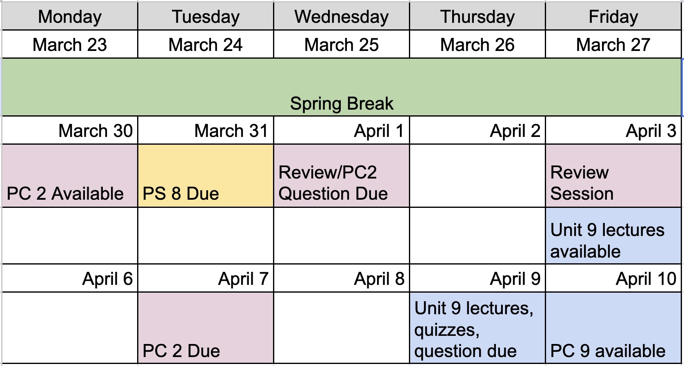

```{r}
#| label: setup
#| message: false
#| warning: false

library(tidyverse)
library(cowplot)

theme_set(theme_cowplot())

```


## After Spring Break

- Quiz due **Wednesday**
- PC 2 available Monday
- Review (start working on) Progress Check 2 before class

{fig-align="center"}


## Quiz 8-3


## What are linear models with categorical variables

- Running a linear model on a categorical "x-axis" doesn't make much sense to me. Am I missing something there? The quiz with the haplotypes does exactly that, correct? Is it looping through each category individually?


## Dropping the intercept

> In what instance would you not want to include the +1 intercept in a model?


## Interaction models coming soon

> Is there a way to fit different slopes for a mixed predictor linear model, or will the resulting lines always share slopes but differ in intercept? Like in lecture 8.4, where the model Energy ~ Mass + Caste was fit, the slope of energy ~ mass for both castes was equal and lines just shifted depending on caste. What would be better in the case that the slope of energy ~ mass differs between caste, e.g. workers expend more energy per unit increase in body mass compared to non-workers?


## Multicollinearity

- If two predictors have high collinearity, does that mean that you should just look at their ability to predict Y separately?


## Fitting multiple models

> As you are going through all these tests and fitting the data to "the best model" how do you do keep track of this workflow and communicate the steps you took to reach the final model when publishing a paper? Because sometimes the process is feeling a bit messy and all over the place as you go through the steps of modeling and re-evaluating things to finally reach the right analysis for the data.
