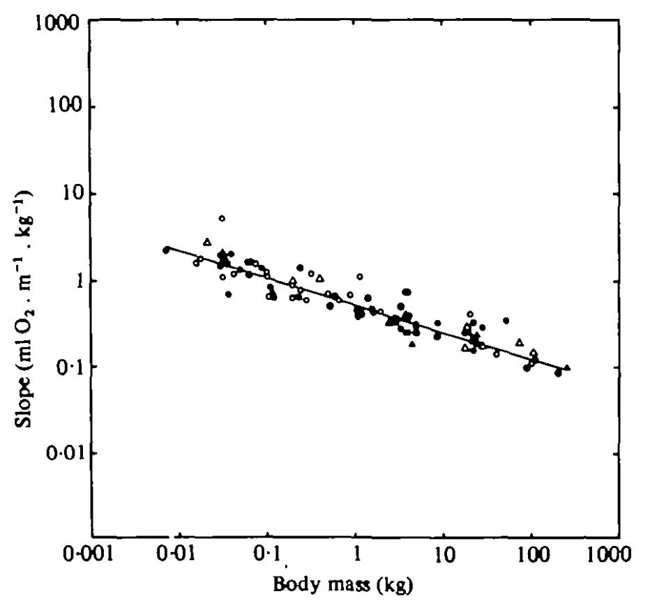

```{r}
#| label: setup
#| message: false
#| warning: false

library(tidyverse)
library(cowplot)
library(wesanderson)
library(lme4)

theme_set(theme_cowplot())

#Quiz 9-1, 9-4
#Answer Ruth directly
#Pull up 9-4 slides & 9-2 slides

```

## Upcoming Events

- Last Review Session: Reading Day
  - Optional & Recorded
  - We'll bring breakfast

## Today

- Interactions
- Partitioning Variance
- Multilevel Models

## Interactions

## Quiz 9-1

> I had a hard time with 9-1, especially figuring out which parameter estimates would actually be significant from the interaction plots. Some of the plots show slight separation or non-parallel lines, but the spread of the data within groups is large enough that those differences might not be statistically significant. I’d really like to go over what we should be prioritizing when interpreting these, like how much weight to give the overall pattern of the lines versus the variability of the points.

## Interactions {.smaller}

> For the very end of lecture 9.1, could you clarify how the interaction term works in the equation? I completely understand how categorical variables act like switches in the equation, but this makes me struggle to see how the + Theta3(X1 * X2) really does anything... since X1 and X2 will just be 1 like in X1*Theta1 and X2*Theta2. It almost seems easier for me to understand how the interaction term would work with continuous predictors. 

> I was thinking that if we use 0 and 1 to represent a three-way interaction, then only the N+P+K+ combination can have a value of 1, while all the others would be 0. In this case, how can we distinguish the N+P+ group?

## Under the Hood

EGK will work on


## Multilevel models

## Quiz 9-4

## Multilevel models {.smaller}

> I understand the need to multilevels modeling to account for "random" variables and non-independence. Referring to the jaw measurements by sex example in lecture 9-04, how are these results reported and discussed in papers? If you wanted to just look at differences between age 12 and compare by sex, would you then just compare the means of measurements between the groups?

> When more than one observation comes from the same individual over time can you elaborate why we cannot plot the means of individuals or group means? Is it misleading visualization? Also if there is a study subject lost at a certain time point how/would you continue the data for that subject since you have data points from the others? If you use 0 then how would you distinguish that from a true 0? 

> In studies with repeated measures (for example, pest monitoring across soybean growth stages), observations from the same experimental unit (plot) are usually not independent. In this case, is the independence assumption always violated? If so, what are the main consequences of "ignoring" this non-independence?

## Partitioning Variance {.smaller}

> When is multiple R2 vs adjusted R2 useful? In the past I used adjusted because I had interaction terms in my models with categorical variables, but I'm not really sure why. My qualitative understanding was that we want the R2 that is associated with each group independently, not the overall combination of all of the groups. Is that somewhat correct or did I get lucky? Example formula: SOC ~ Treatment * Depth

> is there a less is more approach sometimes when it comes to sampling data. for example not taking certain data points like leaf width and leaf length because they would be so correlated or is taking multiple data points and then correcting for the relationship more beneficial?

## Y hat

> Also, in lecture 9.2, why was the calculated y-hat not on the prediction slope?

## Unbalanced Data {.smaller}

> Is sample size difference the main way that a one would determine if a dataset is unbalanced or are other issues (like factors in the wrong order) that would cause the same problem? Additionally, I'm still a bit confused as to when we want type 1, 2, or 3 sums of squares when using unbalanced datasets.

> In addition, I don’t really understand that, in an unbalanced design, variables can share variance.

> One thing I found confusing during this unit was the different types of sums of squares. Specifically, when to use Type II vs Type III sums of squares, and what each approach is actually doing in the analysis.


```{r}
library(tidyverse)
x1 <- rep(0:1,each = 20)
x2 <- c(rep(0:1,each=10), rep(0:1,each=10))

yy <- 5*x1 + 5*x2 + -5*x1*x2 + rnorm(40)

tt <- tibble(x1 = x1,
             x2 = x2, 
             yy = yy)
tt |> print(n=40)

tt |>
  ggplot(aes(x1, yy, color = factor(x2))) +
  geom_point()


```


## Upcoming Events

- Course Evaluations
- Last Review Session: Reading Day
  - Change time?


## General questions

- PC 2: next week

> In the progress check, why was "cost of transport" lower for animals with higher body mass? Did I misunderstand what this measures? My intuition would be that with larger body mass comes a larger amount of work (as in W=Fs) required to move, and therefore higher energy expenditure and more O2 consumed.


## Cost of Transport

$$
COT \propto Mass^{-0.3}
$$

{fig-align="center"}

:::{.right}
Taylor et al., 1982
:::


## Quizzes


## Model summary

> When looking at a summary and results for a model, should you always trust the level of significance given with p values? When should you change the p-value threshold for your analysis?

Coming soon: Multiple comparisons


## Shared variation

> I would like you to explain the figure of Collinearity = High Shared variation, I find it very difficult to understand the graphs where three variables interact in the same plot.


## Model formulas

> What is the difference between the intercept from a linear model and an interaction?

> Will you please further explain the difference between using * and + for interacting variables/when would you use each?

```
lm(Biomass ~ Phosphorous + Nitrogen, data = BM)

lm(Biomass ~ Phosphorous * Nitrogen, data = BM)

```

. . .

```
lm(Biomass ~ Phosphorous + Nitrogen + Phosphorous:Nitrogen, data = BM)
```


## Model formulas

> In slide 27 of 09-1 according to the table, I could think that whenever there are two factors present the interaction will show as one, so how is the model working because as it looks like, it seems that always you will get a relationship when two factors exist.


## Multilevel/Hierarchical/Mixed models

> Could you further explain the use of the 1's in the children's cranial size model from the lecture slides? The model shared is `Distance ~ 1 + Sex + Age + (1 | Subject)`. I understand the `(1| Subject)` tells the model to calculate different means by subject. Would you ever use additional values such as 0 or 2?

> My other question is can you model by multiple "nested groups" for example from my research a plant is a certain bed in a certain plot.


## Multilevel/Hierarchical/Mixed models

> If using explicitly correlated data, can you break down the data into groups where it no longer violates independence? example: I’m looking at acute vs chronic vs sham but multiple ganglia in each group and multiple drug concentrations, if I run linear model on only one ganglia (same one) for each group (sham, chronic, acute) but at only one drug concentration, does this solve the independence issue? Or would it be dividing up data too much and miss possible interactions and correlations?


## Multilevel/Hierarchical/Mixed models

> Also, does the different “cohorts” of animals count as a grouping effect? If you receive animals throughout the year rather than all at once, is this now a group you need to account for with a multilevel model? How does uneven sampling from these cohorts (even with even sampling in your experimental groups) change the interpretations of your data or strength of a model?


## Visualization of Hierarchical Modeling

[http://mfviz.com/hierarchical-models/](http://mfviz.com/hierarchical-models/)


## Data

```{r}
set.seed(543675)
departments <- c(
  'Sociology',
  'Biology',
  'English',
  'Informatics',
  'Statistics'
)
base.salaries <- c(40000, 50000, 60000, 70000, 80000)
annual.raises <- c(2000, 500, 500, 1700, 500)
faculty.per.dept <- 20
total.faculty <- faculty.per.dept * length(departments)

# Generate data frame of faculty and (random) years of experience
ids <- 1:total.faculty
department <- rep(departments, faculty.per.dept)
experience <- floor(runif(total.faculty, 0, 10))
bases <- rep(base.salaries, faculty.per.dept) *
  runif(total.faculty, 0.9, 1.1) # noise
raises <- rep(annual.raises, faculty.per.dept) *
  runif(total.faculty, 0.9, 1.1) # noise
df <- data.frame(
  ids,
  Department = department,
  bases,
  Experience = experience,
  raises
)

# Generate salaries (base + experience * raise)
df <- df |>
  mutate(
    Salary = bases + experience * raises
  )

p <- ggplot(df, aes(x = Experience, y = Salary, color = Department)) +
  geom_point(size = 3)
p
```


## `Salary ~ 1 + Exp`

- No difference in starting salary by department
- No difference in rate of change between departments

```{r}
#| fig-align: center

fm1 <- lm(Salary ~ 1 + Experience, data = df)

preds <- crossing(Department = unique(df$Department), Experience = c(0, 10))
preds <- preds |>
  mutate(fm1 = predict(fm1, newdata = preds))

p +
  geom_line(
    data = preds,
    aes(x = Experience, y = fm1),
    color = "firebrick4",
    linewidth = 1.5
  )
```


## `Salary ~ 1 + Exp + Dept`

- Different starting salary by department
- No difference in rate of change between departments


```{r}
#| fig-align: center

fm2 <- lm(Salary ~ 1 + Experience + Department, data = df)

preds <- preds |>
  mutate(fm2 = predict(fm2, newdata = preds))

p +
  geom_line(
    data = preds,
    aes(x = Experience, y = fm2, color = Department),
    linewidth = 1
  ) +
  geom_line(
    data = preds,
    aes(x = Experience, y = fm1),
    color = "firebrick4",
    linewidth = 1.5
  )
```


## `Salary ~ 1 + Exp + (1 | Dept)`

- Different starting salary by department *also using information from other departments*
- No difference in rate of change between departments

```{r}
fm3 <- lmer(Salary ~ 1 + Experience + (1 | Department), data = df)

preds <- preds |>
  mutate(fm3 = predict(fm3, newdata = preds))
```


## `Salary ~ 1 + Exp + (1 | Dept)`

```{r}
#| fig-align: center

p +
  geom_line(
    data = preds,
    aes(x = Experience, y = fm3, color = Department),
    linewidth = 2,
    linetype = "dashed"
  ) +
  geom_line(
    data = preds,
    aes(x = Experience, y = fm2, color = Department),
    linewidth = 1,
    alpha = 0.5
  ) +
  geom_line(
    data = preds,
    aes(x = Experience, y = fm1),
    color = "firebrick4",
    linewidth = 1.5
  )
```


## Predictions

```{r}
preds |>
  filter(Department %in% c("Sociology", "Statistics")) |>
  knitr::kable()
```


## `Salary ~ 1 + Exp * Dept`

- Back to `lm()`
- Different starting salary by department
- Different rate of change between departments


## `Salary ~ 1 + Exp * Dept`

```{r}
#| fig-align: center

fm4 <- lm(Salary ~ 1 + Experience * Department, data = df)

preds <- preds |>
  mutate(fm4 = predict(fm4, newdata = preds))

p +
  geom_line(
    data = preds,
    aes(x = Experience, y = fm4, color = Department),
    linewidth = 1.5,
    alpha = 0.5
  )
```


## `Salary ~ 1 + Exp + (1 + Exp | Dept)`

- Different starting salary by department *also using information from other departments*
- Different rate of change between departments *also using information from other departments*


## `Salary ~ 1 + Exp + (1 + Exp | Dept)`

```{r}
#| fig-align: center

fm5 <- lmer(
  Salary ~ 1 + Experience + (1 + Experience | Department),
  data = df
)

preds <- preds |>
  mutate(fm5 = predict(fm5, newdata = preds))

p +
  geom_line(
    data = preds,
    aes(x = Experience, y = fm5, color = Department),
    linewidth = 1,
    linetype = "dashed"
  ) +
  geom_line(
    data = preds,
    aes(x = Experience, y = fm4, color = Department),
    linewidth = 2,
    alpha = 0.5
  ) +
  geom_line(
    data = preds,
    aes(x = Experience, y = fm1),
    color = "firebrick4",
    linewidth = 1.5
  )
```
